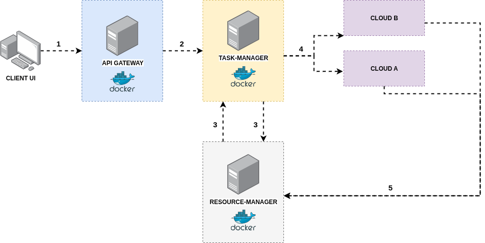

# FedCloud – Simulation d’un Cloud Fédéré

## Description
**FedCloud** est un projet développé dans le cadre d’un cours de **Cloud Computing** visant à simuler un **cloud fédéré** en utilisant **Java**, **Spring Boot** et une architecture **microservices**.  
L’objectif est de reproduire un environnement où plusieurs clouds interagissent via un système d’ordonnancement des tâches et de gestion des ressources.

---

## Architecture

L’architecture repose sur 4 composants principaux :

- **API Gateway** : point d’entrée unique pour toutes les requêtes clients.
- **Task Manager** : gère l’ordonnancement des tâches en fonction des ressources disponibles.
- **Resource Manager** : gère l’inventaire des ressources des clouds.
- **Cloud Runner** : simule l’exécution des tâches sur un cloud spécifique.

### Diagramme d’architecture et Workflow



---

## Workflow détaillé

1. **Soumission d’une tâche** – Le client envoie une tâche via l’**API Gateway**.
2. **Ordonnancement** – Le **Task Manager** analyse la disponibilité et le coût/rapidité d’exécution pour déterminer le cloud optimal.
3. **Vérification des ressources** – Le **Task Manager** interroge le **Resource Manager** pour connaître la disponibilité.
4. **Exécution de la tâche** – La tâche est transmise au **Cloud Runner** (Cloud A, Cloud B, …) choisi.
5. **Retour des résultats** – Les résultats sont renvoyés au client via la passerelle.

---

## Technologies utilisées

- **Java 17+**
- **Spring Boot**
- **Docker**
- **Architecture Microservices**
- **REST API**

---

## 📂 Structure du projet

``` 
fedcloud/
│── api-gateway/ → Point d’entrée des requêtes
│── task-manager/ → Ordonnancement et planification
│── resource-manager/ → Gestion des ressources
│── cloud-runner/ → Simulation des clouds
│── docker-compose.yml → Orchestration des services
```
---

## Installation & Lancement

### Prérequis
- **Java 17+**
- **Maven**
- **Docker** & **Docker Compose**

### Cloner le dépôt
```
git clone https://github.com/ortega-kb/fedcloud.git
cd fedcloud
```

### Lancer avec Docker Compose
```
docker-compose up --build
```

### Accéder aux services
```
API Gateway : http://localhost:8080
```
